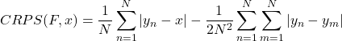
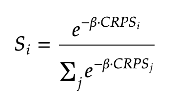
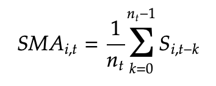
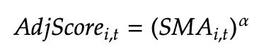
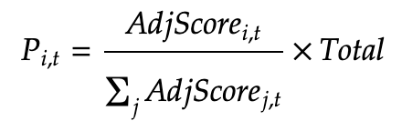

## 1. Task Presented to the Miners
Miners are tasked with providing probabilistic forecasts of a cryptocurrency's future price movements. Specifically, each miner generates multiple simulated price paths for an asset (e.g., Bitcoin) over a specified time horizon. These simulations represent the miner's predictions about how the asset's price may evolve over time.
## 2. Validator's Scoring Methodology
The validator evaluates the miners' probabilistic forecasts using the Continuous Ranked Probability Score (CRPS). The CRPS is a proper scoring rule that measures the accuracy of probabilistic forecasts for continuous variables, considering both the calibration and sharpness of the predictive distribution.
### Application of CRPS to Ensemble Forecasts
In our setup, miners produce ensemble forecasts by generating a finite number of simulated price paths rather than providing an explicit continuous distribution. The CRPS can be calculated directly from these ensemble forecasts using an empirical formula suitable for finite samples.
For a single observation $x$ and an ensemble forecast consisting of $N$ members $y_1, y_2, ..., y_N$, the CRPS is calculated as:

where:
- $F$ is the empirical cumulative distribution function (CDF) represented by the ensemble forecasts
- The first term measures the average absolute difference between the ensemble members and the observation
- The second term adjusts for the spread within the ensemble, ensuring the score accounts for the ensemble's uncertainty
### Application to Multiple Time Increments
To comprehensively assess the miners' forecasts, the CRPS is applied to sets of price changes over different time increments. These increments include short-term and long-term intervals (e.g., 5 minutes, 30 minutes, 3 hours, 24 hours).
For each time increment:
- **Predicted Price Changes**: The miners' ensemble forecasts are used to compute predicted price changes over the specified intervals
- **Observed Price Changes**: The actual market prices are used to calculate the observed price changes over the same intervals
- **CRPS Calculation**: The CRPS is calculated for each increment by comparing the ensemble of predicted price changes to the observed price change
## 3. Allocation of Prize Money
Each day, a fixed amount of prize money (e.g., $1000) is distributed among miners based on their performance.
### Normalization Using Softmax Function
After calculating the CRPS scores, the validator normalizes these scores daily. The normalized score $S_i$ for miner $i$ is calculated as:  

  

where:
- $CRPS_i$ is the total CRPS score for miner $i$ on that day
- $\beta = \frac{1}{1000}$ is the scaling factor
- The negative sign ensures better forecasts (lower CRPS) receive higher scores
### Simple Moving Average (SMA) of Scores
The SMA for miner $i$ on day $t$ is calculated as:  

  

where:
- $n_t = min(t,n)$ is the number of days included
- $S_{i,t-k}$ is the normalized score of miner $i$ on day $t-k$
### Prize Distribution Based on SMA
Adjusted Scores:  

  

Prize Allocation:  

  

## 4. Simulating a Collection of Miners with Different Models
### Price Simulation Model
Miners use a stochastic process, incorporating:
- Current Asset Price
- Time Increments
- Total Time Horizon
- Volatility ($\sigma$)
### Varying Volatility ($\sigma$)
Miners are differentiated by their volatility parameters:
- **High Volatility Miners**: Use larger $\sigma$ values
- **Low Volatility Miners**: Use smaller $\sigma$ values
## Overall Purpose
The system creates a competitive environment through:
1. **Implementing CRPS Scoring**
   - Objectively measures forecast quality across multiple time increments
2. **Using Ensemble Forecasts**
   - Calculates CRPS from finite ensemble of simulations
3. **Applying CRPS to Different Time Increments**
   - Evaluates both short-term and long-term predictions
4. **Normalizing Scores**
   - Ensures fair comparison using softmax function ($\beta = \frac{1}{1000}$)
5. **Calculating SMA and Allocating Prize Money**
   - Rewards consistent performance and encourages competition
