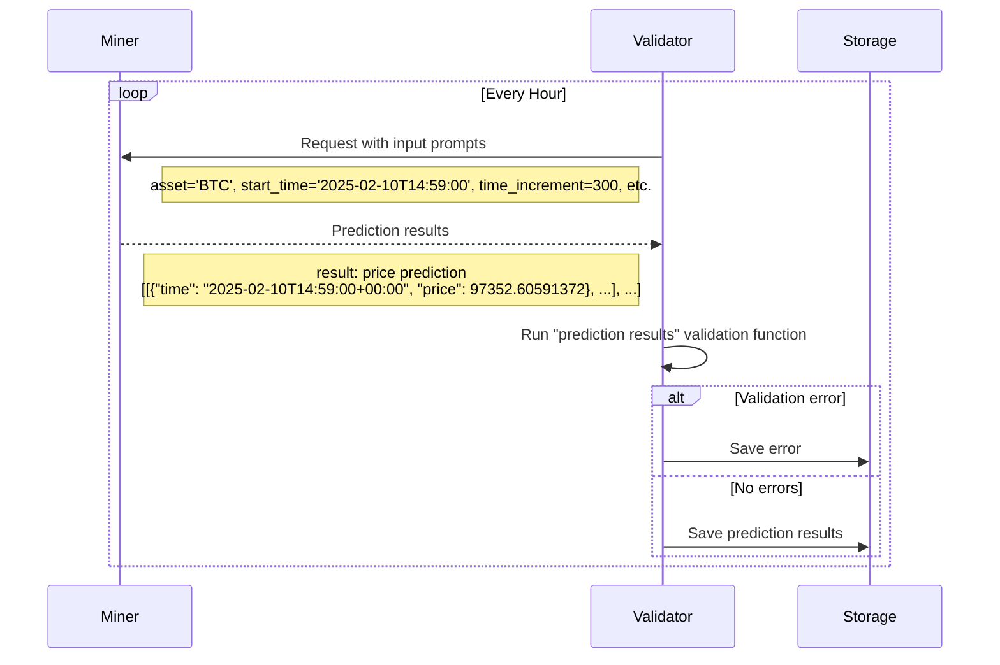
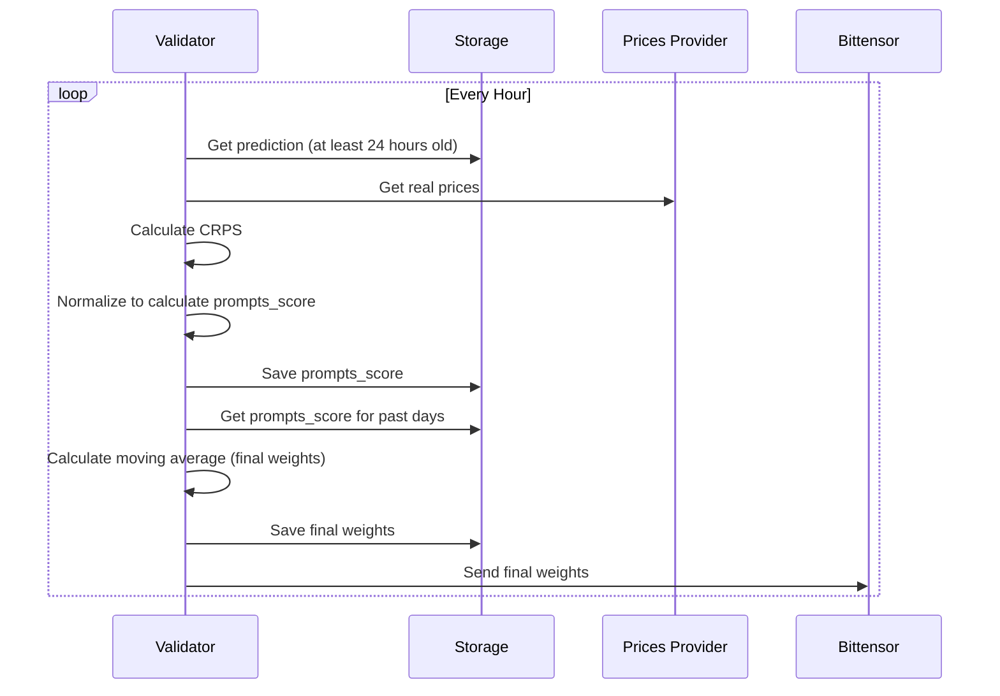

<div align="center">
  <a href="https://mode.network">
    
  </a>
</div>

<div align="center">
  <a href="https://github.com/mode-network/synth-subnet/blob/main/LICENSE">
    
  </a>
</div>

<h1 align="center">
    Synth Subnet
</h1>

<div align="center">
    <a href="https://www.mode.network/synth" target="_blank">
        <b>Website</b>
    </a>
·
    <a href="https://github.com/mode-network/synth-subnet/blob/main/Synth%20Whitepaper%20v1.pdf" target="_blank">
        <b>Whitepaper</b>
    </a>
·
    <a href="https://discord.gg/3sqFJFsz" target="_blank">
        <b>Discord</b>
    </a>
·
    <a href="https://synth.mode.network/docs" target="_blank">
        <b>API Documentation</b>
    </a>
</div>

---

### Table Of Contents

* [1. Overview](#-1-overview)
  - [1.1. Introduction](#11-introduction)
  - [1.2. Task Presented to the Miners](#12-task-presented-to-the-miners)
  - [1.3. Validator's Scoring Methodology](#13-validators-scoring-methodology)
  - [1.4. Calculation of Leaderboard Score](#14-calculation-of-leaderboard-score)
  - [1.5. Overall Purpose](#15-overall-purpose)
* [2. Usage](#-2-usage)
  - [2.1. Requirements](#21-requirements)
  - [2.2. Setup](#22-setup)
  - [2.3. Miners](#23-miners)
  - [2.4. Validators](#24-validators)
* [3. License](#-3-license)

## 🔭 1. Overview

### 1.1. Introduction

The Synth Subnet leverages Bittensor’s decentralized intelligence network to create the world's most powerful synthetic data for price forecasting. Unlike traditional price prediction systems that focus on single-point forecasts, Synth specializes in capturing the full distribution of possible price movements and their associated probabilities, to build the most accurate synthetic data in the world. 

Miners in the network are tasked with generating multiple simulated price paths, which must accurately reflect real-world price dynamics including volatility clustering and fat-tailed distributions. Their predictions are evaluated using the Continuous Ranked Probability Score (CRPS), which measures both the calibration and sharpness of their forecasts against actual price movements.  

Validators score miners on short-term and long-term prediction accuracy, with recent performance weighted more heavily through an exponential decay function. Daily emissions are allocated based on miners’ relative performance, creating a competitive environment that rewards consistent accuracy.

<div align="center">
    
</div>

Figure 1.1: Overview of the synth subnet.

The Synth Subnet aims to become a key source of synthetic price data for AI Agents and the go-to resource for options trading and portfolio management, offering valuable insights into price probability distributions.

<sup>[Back to top ^][table-of-contents]</sup>

### 1.2. Task Presented to the Miners



Miners are tasked with providing probabilistic forecasts of a cryptocurrency's future price movements. Specifically, each miner is required to generate multiple simulated price paths for an asset, from the current time over specified time increments and time horizon. Initially all checking prompts will be to produce 100 simulated paths for the future price of bitcoin at 5-minute time increments for the next 24 hours. 

Whereas other subnets ask miners to predict single values for future prices, we’re interested in the miners correctly quantifying uncertainty. We want their price paths to represent their view of the probability distribution of the future price, and we want their paths to encapsulate realistic price dynamics, such as volatility clustering and skewed fat tailed price change distributions. Subsequently we’ll expand to requesting forecasts for multiple assets, where modelling the correlations between the asset prices will be essential.

If the miners do a good job, the Synth Subnet will become the world-leading source of realistic synthetic price data for training AI agents. And it will be the go-to location for asking questions on future price probability distributions - a valuable resource for options trading and portfolio management.

The checking prompts sent to the miners will have the format:
(start_time, asset, time_increment, time_horizon, num_simulations)

Initially prompt parameters will always have the following values:
- **Start Time ($t_0$)**: 1 minute from the time of the request.
- **Asset**: BTC
- **Time Increment ($\Delta t$)**: 5 minutes.
- **Time Horizon ($T$)**: 24 hours.
- **Number of Simulations ($N_{\text{sim}}$)**: 100.


The miner has until the start time to return ($N_{\text{sim}}$) paths, each containing price predictions at times given by:

$$
t_i = t_0 + i \times \Delta t, \quad \text{for }\, i = 0, 1, 2, \dots, N
$$

where:

- $N = \dfrac{T}{\Delta t}$ is the total number of increments.

We recommend the miner sends a request to the Pyth Oracle to acquire the price of the asset at the start_time.

If they fail to return predictions by the start_time or the predictions are in the wrong format, they will be scored 0 for that prompt.

<sup>[Back to top ^][table-of-contents]</sup>

### 1.3. Validator's Scoring Methodology

The role of the validators is, after the time horizon as passed, to judge the accuracy of each miner’s predicted paths compared to how the price moved in reality. The validator evaluates the miners' probabilistic forecasts using the Continuous Ranked Probability Score (CRPS). The CRPS is a proper scoring rule that measures the accuracy of probabilistic forecasts for continuous variables, considering both the calibration and sharpness of the predicted distribution. The lower the CRPS, the better the forecasted distribution predicted the observed value.

#### Application of CRPS to Ensemble Forecasts

In our setup, miners produce ensemble forecasts by generating a finite number of simulated price paths rather than providing an explicit continuous distribution. The CRPS can be calculated directly from these ensemble forecasts using an empirical formula suitable for finite samples.

For a single observation $x$ and an ensemble forecast consisting of $N$ members $y_1, y_2, \dots, y_N$, the CRPS is calculated as:

$$
\text{CRPS} = \frac{1}{N}\sum_{n=1}^N \left| y_n - x \right| - \frac{1}{2N^2} \sum_{n=1}^N \sum_{m=1}^N \left| y_n - y_m \right|
$$

where:

- The first term $\dfrac{1}{N}\sum_{n=1}^N \left| y_n - x \right|$ measures the average absolute difference between the ensemble members and the observation $x$.
- The second term $\dfrac{1}{2N^2} \sum_{n=1}^N \sum_{m=1}^N \left| y_n - y_m \right|$ accounts for the spread within the ensemble, ensuring the score reflects the ensemble's uncertainty.


This formulation allows us to assess the miners' forecasts directly from their simulated paths without the need to construct an explicit probability distribution.

#### Application to Multiple Time Increments

To comprehensively assess the miners' forecasts, the CRPS is applied to sets of price changes over different time increments. These increments include short-term and long-term intervals (in the case of the initial checking prompt parameters, these will be 5 minutes, 30 minutes, 3 hours, 24 hours).

For each time increment:
- **Predicted Price Changes**: The miners' ensemble forecasts are used to compute predicted price changes over the specified intervals
- **Observed Price Changes**: The real asset prices are used to calculate the observed price changes over the same intervals. We recommend the validators collect and store the prices by sending requests to the Pyth oracle at each time increment, to be used at the end of the time horizon.
- **CRPS Calculation**: The CRPS is calculated for each increment by comparing the ensemble of predicted price changes to the observed price change.
  
The final score for a miner for a single checking prompt is the sum of these CRPS values over all the time increments.

<sup>[Back to top ^][table-of-contents]</sup>

### 1.4. Calculation of Leaderboard Score



#### Normalization Using Softmax Function

After calculating the sum of the CRPS values, the validator normalizes these scores across all miners who submitted correctly formatted forecasts prior to the start time. The normalized score $S_i$ for miner $i$ is calculated as:

$$
S_i = \frac{e^{-\beta \cdot CRPS_i}}{\sum_j e^{-\beta \cdot CRPS_j}}
$$

where:
- $CRPS_i$ is the sum of CRPS values for miner $i$ on that day
- $\beta = \frac{1}{1000}$ is the scaling factor
- The negative sign ensures better forecasts (lower CRPS) receive higher scores

Any miners who didn’t submit a correct prediction are allocated a normalised score of 0 for that prompt.

#### Exponentially Decaying Time-Weighted Average (Leaderboard Score)

The validator is required to store the historic request scores for each miner. After each new request is scored, the validator recalculates the ‘leaderboard score’ for each miner, using an exponentially decaying time-weighted average over their past **per request** scores, up to a threshold of 30 days in the past.

This approach emphasizes recent performance while still accounting for historical scores. 
The leaderboard score for miner $i$ at time $t$ is calculated as:

$$
L_i(t) = \frac{\sum_{j} w_j \, S_{i,j}}{\sum_{j} w_j}
$$

where:

- $S_{i,j}$ is the normalized score of miner $i$ at request $j$.
- $w_j = e^{-\lambda (t - t_j)}$ is the weight assigned to the score $S_{i,j}$.
- $t_j$ is the time of request $j$.
- $\lambda = \dfrac{\ln 2}{h}$ is the decay constant, with half-life $h = 10$ days.
- The sum runs over all requests $j$ such that $t - t_j \leq T$, where $T = 30$ days is the threshold time.

#### Allocation of Emissions 
At the end of each day, the leaderboard scores are then raised to the power of an exponent $\alpha$ (e.g., $\alpha = 2$) to amplify performance differences. The adjusted scores determine each miner's share of the total emissions for that day

Adjusted Scores:

$$
AdjScore_{i,t} = (L_{i,t})^\alpha
$$

Emissions Allocation:

$$
P_{i,t} = \frac{AdjScore_{i,t}}{\sum_j AdjScore_{j,t}} \times Total
$$

<sup>[Back to top ^][table-of-contents]</sup>

### 1.5. Overall Purpose

The system creates a competitive environment through:

1. **Implementing CRPS Scoring**
   - Objectively measures forecast quality across multiple time increments

2. **Using Ensemble Forecasts**
   - Calculates CRPS from finite ensemble of simulations

3. **Applying CRPS to Different Time Increments**
   - Evaluates both short-term and long-term predictions

4. **Normalizing Scores**
   - Ensures fair comparison using softmax function ($\beta = \frac{1}{1000}$)

5. **Calculating Leaderboard Scores and Allocating Emissions**
   - Rewards consistent performance and encourages competition

<sup>[Back to top ^][table-of-contents]</sup>

## 🪄 2. Usage

### 2.1. Requirements

* [Git](https://github.com/git-guides/install-git)
* [Ubuntu v20.04+](https://ubuntu.com/download)

<sup>[Back to top ^][table-of-contents]</sup>

### 2.2. Setup

**Step 1: Clone the repository**

```shell
git clone https://github.com/mode-network/synth-subnet.git
```

**Step 2: Change directory to the project root**

```shell
cd ./synth-subnet
```

**Step 3: Add the required repositories**

```shell
sudo add-apt-repository ppa:deadsnakes/ppa
```

> ⚠️ **NOTE:** The [deadsnakes](https://github.com/deadsnakes) repository, while unofficial, it is hugely popular and used by many Python projects.

**Step 4: Install Rust**

```shell
curl --proto '=https' --tlsv1.2 -sSf https://sh.rustup.rs | sh
```

**Step 5: Install the dependencies**

```shell
sudo apt update && \
  sudo apt install nodejs npm python3.10 pkg-config
```

**Step 6: Install [PM2](https://pm2.io/)**

```shell
sudo npm install pm2 -g
```

**Step 7: Install the Python environment**

```shell
sudo apt install python3.10-venv
```

**Step 8: Create a new Python environment**

```shell
python3.10 -m venv bt_venv
```

**Step 9: Activate and switch to the newly created Python virtual environment**

```shell
source bt_venv/bin/activate
```

This should activate the `bt_venv` environment and you should see the command line prefixed with `(bt_venv)`.

**Step 10: Install local Python dependencies**

With the Python virtual environment active, install the Python dependencies:
```shell
pip install -r requirements.txt
```

<sup>[Back to top ^][table-of-contents]</sup>

### 2.3. Miners

Please refer to this [guide](./docs/miner_guide.md) for detailed instructions on getting a miner up and running.

<sup>[Back to top ^][table-of-contents]</sup>

### 2.4. Validators

Please refer to this [guide](./docs/validator_guide.md) for detailed instructions on getting a validator up and running.

<sup>[Back to top ^][table-of-contents]</sup>

## 📄 3. License

Please refer to the [LICENSE](./LICENSE) file.

<sup>[Back to top ^][table-of-contents]</sup>

<!-- links -->
[table-of-contents]: #table-of-contents
